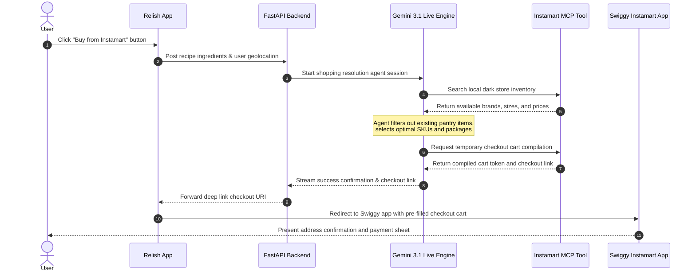

# Technical Architecture & Swiggy Instamart Integration Proposal

Welcome to the official integration proposal for **Relish**. This document details the high-level architecture of the Relish app, including the implementation of the **Gemini Multimodal Live API** for hands-free kitchen voice assistance, and the proposed **Swiggy Instamart Integration** from a feature and use-case perspective.

---

## 1. System Overview

**Relish** is a next-generation smart culinary assistant designed to guide home cooks through cooking steps interactively and hands-free. 

```
  ┌─────────────────────────────────────────────────────────────┐
  │                        React Native App                     │
  │                        (Expo, Tailwind)                     │
  └──────────────┬───────────────────────────────▲──────────────┘
                 │ PCM Audio / JSON              │ PCM Audio / JSON
                 │ (WebSockets)                  │ (WebSockets)
  ┌──────────────▼───────────────────────────────┴──────────────┐
  │                       FastAPI Backend                       │
  │     (Orchestration, Firebase Auth, Session Management)      │
  └──────────────┬───────────────────────────────▲──────────────┘
                 │ Bidirectional WS Stream       │ Bidirectional WS Stream
                 │ (google-genai SDK)            │ (google-genai SDK)
  ┌──────────────▼───────────────────────────────┴──────────────┐
  │                 Gemini Multimodal Live API                  │
  │       (Low-latency Gemini 3.1 Flash Live Engine)            │
  └──────────────┬──────────────────────────────┘
                 │ Tool Calls (MCP Protocol)
  ┌──────────────▼──────────────────────────────┐
  │                Swiggy Instamart Integration                 │
  │           (Search, Pantry Restock, Cart Resolution)          │
  └──────────────┬──────────────────────────────┘
                 │ Deep Link / Cart Exchange
  ┌──────────────▼──────────────────────────────┐
  │                    Swiggy Instamart App                     │
  └─────────────────────────────────────────────────────────────┘
```

### Key Capabilities:
1. **URL Recipe Extraction**: Strips video scripts from platforms (e.g., YouTube) and transforms them into clean, structured recipes.
2. **Hands-free Live Studio**: A full-duplex voice interface running on the **Gemini Multimodal Live API** (powered by `gemini-3.1-flash-live`) that guides users step-by-step through instructions.
3. **Smart Shopping Cart**: Resolves recipe ingredients to local store inventory and compiles grocery orders, which users can export directly to their Instamart cart via a button click. **For safety and friction-free control, ordering is not performed via voice.**

---

## 2. Technical Architecture

### Frontend (React Native & Expo)
- **UI & Layout**: Custom styling built with NativeWind (Tailwind CSS) and optimized React Native StyleSheet constructs. All touchable elements utilize state-controlled press states (`useState` + `onPressIn/Out`) to bypass NativeWind pressed-state bugs and render high-performance 60fps micro-animations.
- **Audio I/O**: Captures raw PCM input via `expo-av` or native recording bridges, encoding speech in real-time. Audio output is streamed to a low-latency PCM playback channel.

### Backend (FastAPI)
- **Websockets Gateway**: Acts as a low-latency proxy between the React Native client and the Gemini Multimodal Live API. It forwards speech chunks bidirectionally, maintaining minimal packaging overhead.
- **Authentication**: Firebase SDK verification to secure user profiles and restrict API endpoints.
- **Orchestration**: Manages system prompts, context injection, and agent tools.

### LLM Interface (Gemini Multimodal Live API)
- **Multimodal Live Protocol**: Uses bidirectional WebSockets to stream microphone audio directly to the Gemini model and retrieve real-time generated speech output.
- **Low-Latency Engine**: Leveraging the `gemini-3.1-flash-live` model configured for direct audio-to-audio streaming.

---

## 3. Swiggy Instamart Integration & Use Cases

Rather than using complex external database syncing, Relish plans to integrate with Swiggy Instamart's developer tools via a planned Model Context Protocol (MCP) server. From a feature perspective, the Gemini agent leverages these tools to solve real-world cooking preparation friction:

> [!IMPORTANT]
> **No Voice-Based Checkout**: To prevent accidental orders, the Gemini Multimodal Live voice interface is strictly utilized for hands-free cooking help, recipe walkthroughs, and pantry reviews. **Users cannot purchase items via voice commands.** To order, the user must explicitly click the physical "Buy from Instamart" button in the Relish application UI, which compiles the optimized list of missing ingredients and launches the Swiggy Instamart application for final address selection and payment.

### Key Integration Use Cases:
1. **Order Missing Ingredients**: 
   When a user clicks "Buy from Instamart" on a recipe card (e.g., *Brown butter gnocchi*), the Relish agent checks the required ingredients against the user's digital pantry. Instead of ordering the whole recipe blindly, it filters out items already in stock (like salt, pepper, or olive oil) and adds only the missing items (like gnocchi or heavy cream) to the cart.
2. **Meal-Plan Based Pantry Restocking**: 
   Users can plan their meals for the week. The Relish AI consolidates the required grocery lists from all planned recipes, checks common staples, and aggregates them into a single, optimized Swiggy Instamart restock order.
3. **AI-Driven SKU & Quantity Resolution**: 
   Recipes call for semantic measurements (e.g., *"3 cloves of garlic, minced"*, *"2 tablespoons of butter"*). The integration uses the agent to fuzzy-match these requirements with actual local dark-store product inventory (e.g., mapping to a "50g pack of Garlic" and "100g block of Amul Butter"), choosing the smallest viable pack size to reduce consumer cost and food waste.



### Value to the User:
- **Instant Shopping**: From recipe discovery to ingredients arriving at their doorstep in 10 minutes.
- **Smart Substitution**: AI automatically handles sizing and brand selections based on user diet preferences and catalog availability.

---

> [!NOTE]
> For a highly detailed overview, including database configurations, network protocols, safety frameworks, and edge cases, please refer to the PDF documentation: [Relish & Swiggy Instamart Architecture Profile](file:///d:/Chef%20Leo%20AI%20app/instamart-integration/relish_instamart_architecture.pdf).

